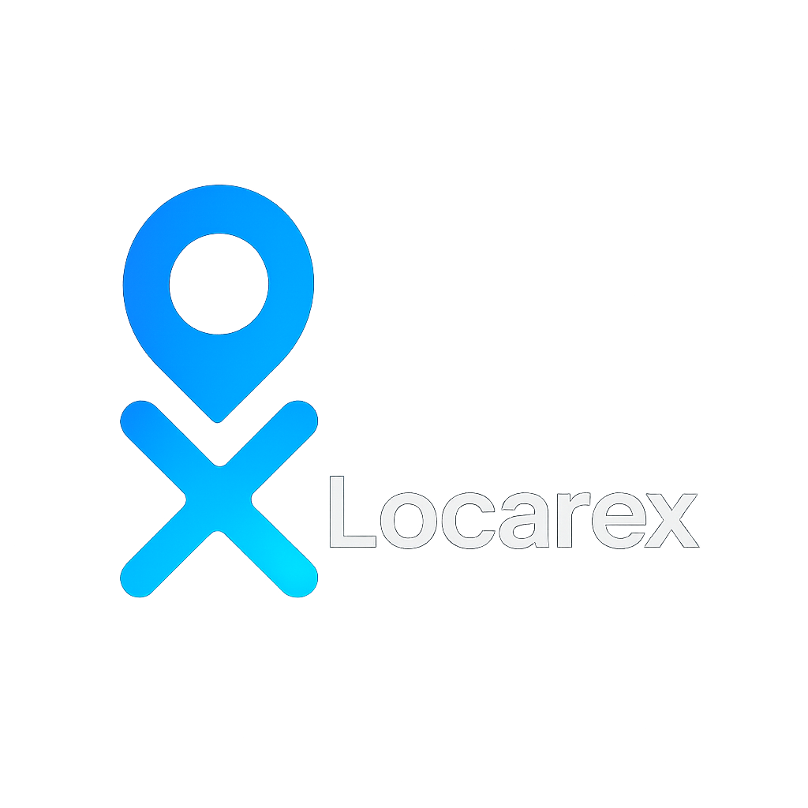

# Locarex



A small, lightweight module to help locate users and objects for building location-aware apps and demos.

Highlights
- Simple browser and module-friendly API
- Lightweight: focused on locating a user or obtaining location data from a provider
- Optional camera-based country detection via the Recordanex helper module

Status
- Prototype / early-stage — feedback and contributions welcome.

Quick demo (browser)
```html
<!-- Load Locarex from CDN or your host -->
<script src="https://locarex.net"></script>

<script>
  // Example (browser)
  const user = new locarex.UserProvider("Ramses");
  const location = new locarex.LocateFromUser(user);

  // getLocation may be async / callback-based depending on implementation
  location.getLocation(user)
    .then(loc => console.log('Location:', loc))
    .catch(err => console.error('Could not get location', err));
</script>
```

Install / Import
- CDN/script tag:
```html
<script src="https://locarex.net"></script>
```
- ES module (if hosted as ES module):
```javascript
import locarex from 'https://locarex.net/v1/locarex.js';
```
(Adjust path to your hosting setup or npm package if you publish Locarex.)

Basic Usage (JS)
```javascript
// Create a user provider and a locator
const user = new locarex.UserProvider("Ramses");
const locator = new locarex.LocateFromUser(user);

// Example usage returning a Promise
locator.getLocation(user)
  .then(location => {
    // location example: { latitude: 12.34, longitude: 56.78, country: 'YourCountry' }
    console.log('Found location:', location);
  })
  .catch(err => {
    console.error('Location error:', err);
  });
```

API (quick reference)
- new locarex.UserProvider(name)
  - Creates a simple user context/provider. `name` is a display identifier.
- new locarex.LocateFromUser(user)
  - Creates a locator bound to a UserProvider instance.
- LocateFromUser.getLocation(user)
  - Attempts to get the current location. Implementation may:
    - use the browser Geolocation API (async/Promise)
    - fallback to IP-based geolocation
    - return an object: { latitude, longitude, accuracy?, country?, provider? }

Camera-based country detection (Recordanex)
If you want to detect country using the camera image, there's a separate helper module Recordanex mentioned in your original README. Example:
```javascript
import { Record } from "https://recordanex/js/v1";

Record.play();
```
Notes:
- Ensure the import path is correct and the module exposes `Record`. If you host Recordanex, use a full URL to the .js file or package entry.


Contributing
- Open issues for bugs or feature requests.
- PRs welcome — please include tests or a short demo.
